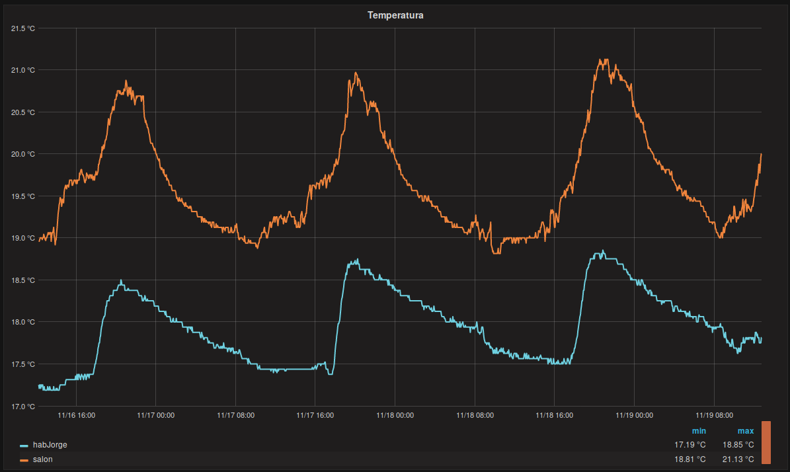
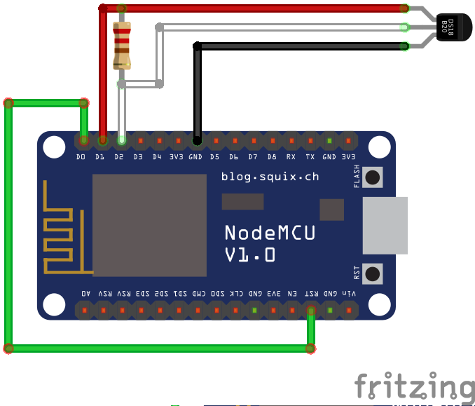
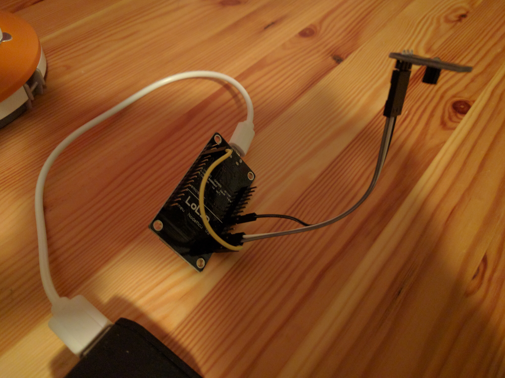

# NodeMCU Wifi thermometer

Graph temperatures with wifi sensors. The wifi sensors are NodeMCU boards based on the ESP8266 using one or more DS18B20 sensors per board. The information is sent via wifi to a server setup. My current setup is a nodejs server processing the info and sending it to Graphite via StatsD. For visualization, I am using Grafana.



## Building the sensors.

The sensor is a NodeMCU board plus one or more DS18B20 probes connected using the 1-wire protocol https://en.wikipedia.org/wiki/1-Wire .
Three wires are used for 1-wire:
- Ground goes to the NodeMCU ground.   
- Vcc goes to NodeMCU pin D1 to turn the probe on just when needed
- DQ goes to NodeMCU pin D2

Usually a 4.7K resistor has to be connected from Ground to DQ on the DS18B20. My probes came with a small board already providing it. Many DS18B20 can be plugged serially to the same pins. The Lua program on the board will detect them and send all the readings.

Another wire connects the NodeMCU reset and D0 pins. This is required to use the ESP8266 sleep feature. Remember to unwire reset when flashing the NodeMCU.

I am providing power from the USB connector.




## Flashing NodeMCU on the board.

See info on the NodeMCU site: https://nodemcu.readthedocs.io/en/master/en/upload/

The command I use is:
```
python esptool/esptool.py --port /dev/ttyUSB0 write_flash 0x00000 nodemcu-firmware-images/nodemcu-master-11-modules-2016-01-24-21-02-28-float.bin
```
To fully erase the flash to remove bogus lua files:
```
python esptool/esptool.py --port /dev/ttyUSB0 erase_flash
```

Remember to remove the wire from D0 to RST when flashing the firmware.

If the NodeMCU is properly flashed and connected to a computer, it can be used in immediate mode over serial. To find the device I use dmesg.

The command I use in Linux is:
```
screen /dev/ttyUSB0 9600
```
[Exit with Ctrl-A k y]

Configuring Wifi in immediate mode is convenient. You can use:
```
wifi.setmode(wifi.STATION)
wifi.sta.config("WIFI_NAME", "WIFI_PASSWORD")
print(wifi.sta.getip())
```
You should get an IP of your home network.

## Upload the Lua code to the sensor.
Edit init.lua to configure the server ip and port as well as the sleep time between reads.
There are two files to upload:

- init.lua: this is autoloaded on boot or when waking up from sleep.
- DS18B20.lus: main program

To upload the code on Linux I use the luatool https://github.com/4refr0nt/luatool, with the following commands:
```
../../luatool/luatool/luatool.py --port /dev/ttyUSB0 --src init.lua --dest init.lua --verbose
../../luatool/luatool/luatool.py --port /dev/ttyUSB0 --src DS18B20.lua --dest DS18B20.lua --verbose
```

To stop the reboot-sleep cycle, run in the terminal connected to the board:

```
a=1
```
If this doesn't work. Erase the flash and rewrite the firmware. A way to get into flash mode is to remove the wire from D0 to RST and wait for reboot time. Reboot won't work but will put the board in flashable ready state. 

## Run the server
Edit server.js to put the port and ip of the statsD server.
Edit server.js to change the mapping of sensors to graphite keys.

To launch, execute in the server folder:
```
npm install
npm start
```


